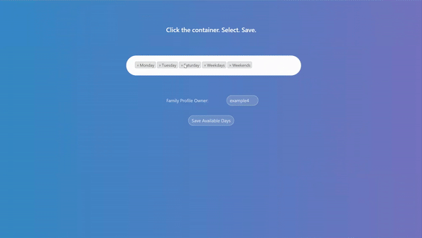
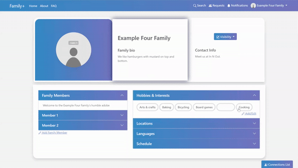
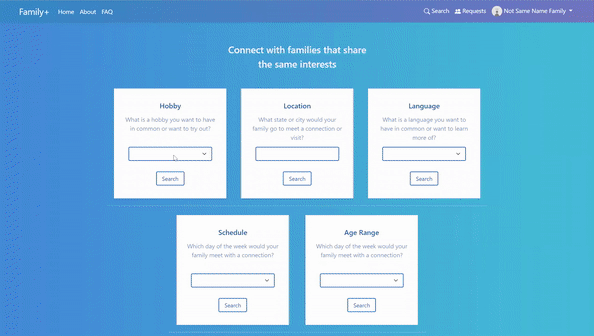
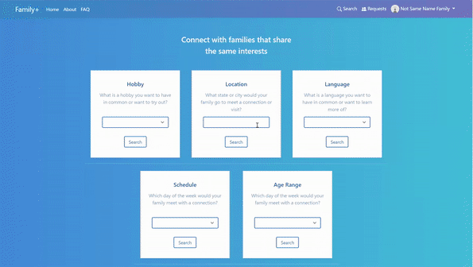
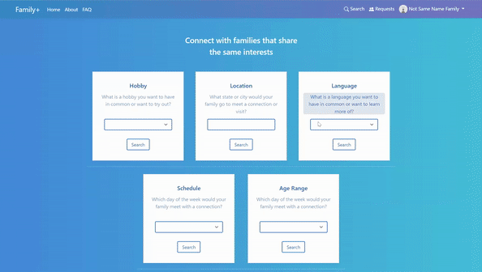
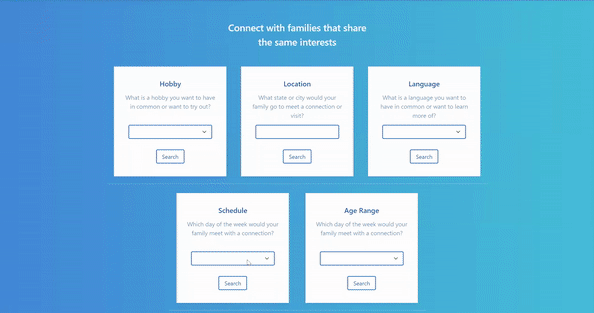
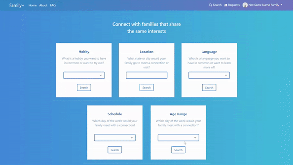

<h1 align="center" name="page-top">Family+ Web App</h1>

<h2 align="center">Project Purpose</h2>

Many parents and caretakers are busy with work and they find it difficult to hold gatherings with friends and family. They want to find others that fit their schedule and who have similar interests.
<br><br>
**Family+ allows you and your family to...**

- Find new connections and connect with other families
- Create a family profile and share your family’s hobbies, interests, and more
- Search for others with similar interests (hobby, location in the U.S., language, days available in a week, and age range)

<h2 align="center">Tech Stack</h2>

<p align="center">
       
</p>

<h2 align="center">Features</h2>

<p align="center">
    <strong>:pencil2: Sign Up & Log In With Email</strong> <br><br>
    
</p>

<p align="center">
    <strong>:family_man_woman_girl_boy: Create A Profile For Your Family</strong> <br><br>
    
</p>

<p align="center">
    <strong>:memo: Add Info On Your Family Members</strong> <br><br>
    
</p>

<p align="center">
    <strong>:mag: Pick & Share Interests For Your Family</strong>
</p>

| ...                                      | ...                                      |
| ---------------------------------------- | ---------------------------------------- |
|  |  |

<p align="center">
    <strong>:mag_right: Search For Others By...</strong>
</p>

|                         Hobby                          |                            Location                            |
| :----------------------------------------------------: | :------------------------------------------------------------: |
|      |           |
|                      **Language**                      |                          **Schedule**                          |
|   |           |
|                     **Age Range**                      |                 **Family Nickname & Username**                 |
|  |  |

<p align="center">
    <strong>:busts_in_silhouette: View Your Connection Requests</strong> <br><br>
    
</p>

<p align="center">
    <strong>:bookmark_tabs: View Your Connections List</strong> <br><br>
    
</p>

<h2 align="center">Mini Installation Guide</h2>

<p align="center">
    Required: Python Version 3.6+ <br>
    Recommend: Work in a python virtual environment
</p>

**Install required packages:**

```
pip install -r requirements.txt
```

<h3 align="center">Run Django Server</h3>

<p align="center">
    In the root directory that has manage.py, place your SECRET_KEY and DEBUG values in an **.env** file. Make sure they are without quotation marks and whitespace. See <a href="https://github.com/angelptli/family-plus-web-app/blob/main/family_plus/.env.example">.env.example</a>.
</p>

**To generate a SECRET KEY in the terminal use this command:**

```
python -c "from django.core.management.utils import get_random_secret_key; print(get_random_secret_key())"
```

**Migrate Django models to create the SQLite database:**

```
python manage.py makemigrations
```

```
python manage.py migrate
```

**Run Django server locally**

```
python manage.py runserver
```

<p align="center">
    Enter localhost:8000 in a web browser to arrive at Family+ welcome page. <br>
    Note: full installation guide at <a href="./clone_guide.md">clone_guide.md</a>.
</p>

<p align="center">
    <a href="#page-top">Back To Top</a>
</p>