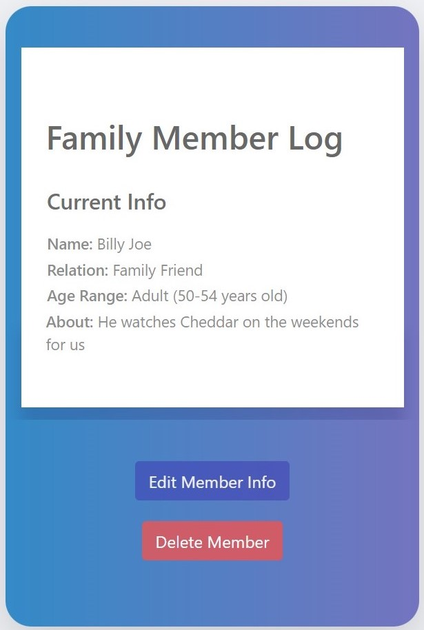

# Family+ Web App

## Project Purpose

Many parents and caretakers are busy with work and they find it difficult to hold gatherings with friends and family. They want to find others that fit their schedule and who have similar interests.
  
**Family+ allows you and your family to...**
- Find new connections and connect with other families
- Create a family profile and share your family’s hobbies, interests, and more
- Search for others with similar interests (hobby, location in the U.S., language, days available in a week, and age range) 

## Tech Stack
Django, Python, HTML, CSS, JS, Bootstrap

## Features
Sign up and log in with an email  

Create a family profile  

Add member info on your family  

Each member gets their own log  

Pick and share your interests on your family profile

... | ...
---|---
 | 

Search for others by hobby, location, language, schedule, age range, family nickname, and username

Hobby | Location
:---:|:---:
 | 
**Language** | **Schedule**
 | 
**Age Range** | **Family Nickname & Username**
 | 

View your connection requests  

View a list of your connections  

Dynamic viewing for smaller screens  

